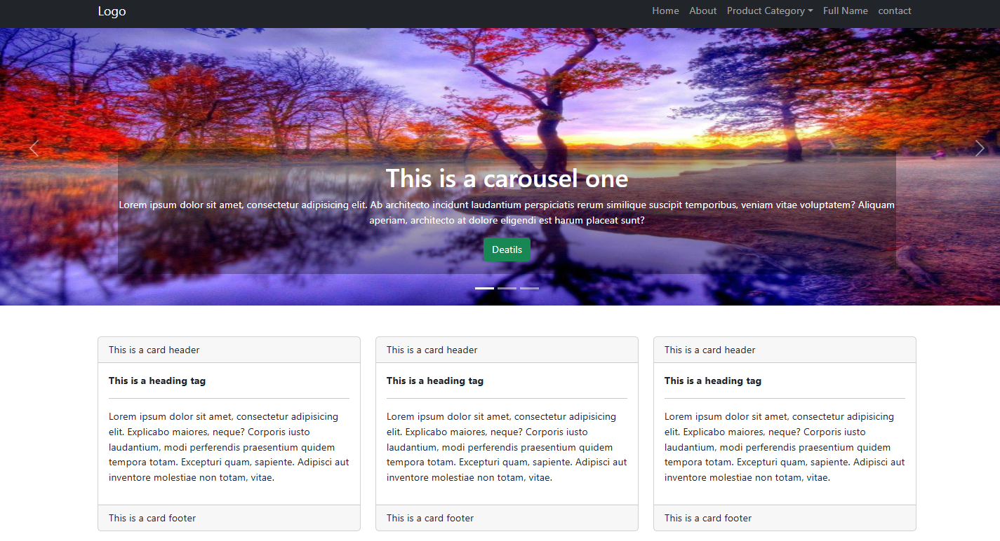
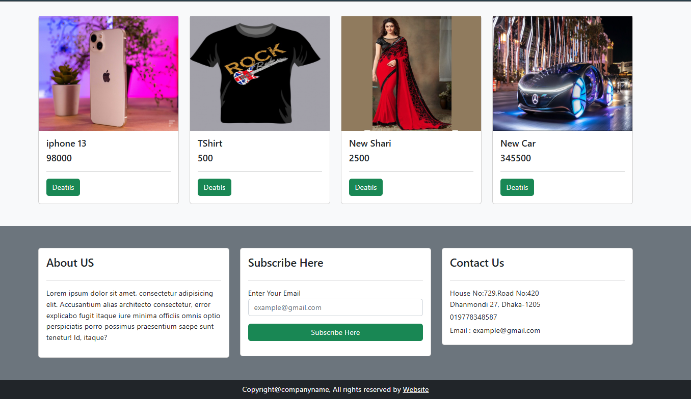
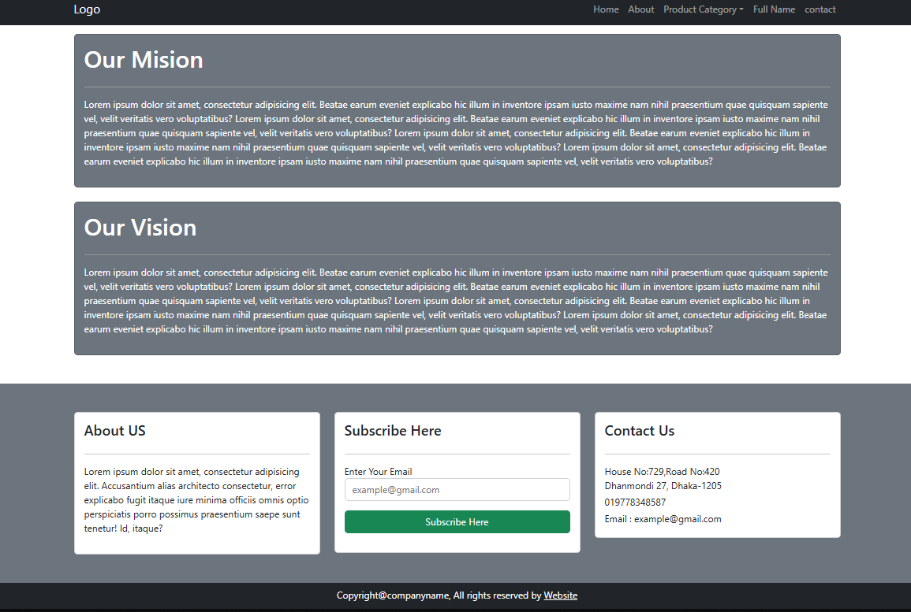
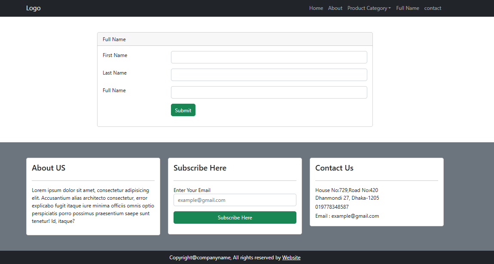
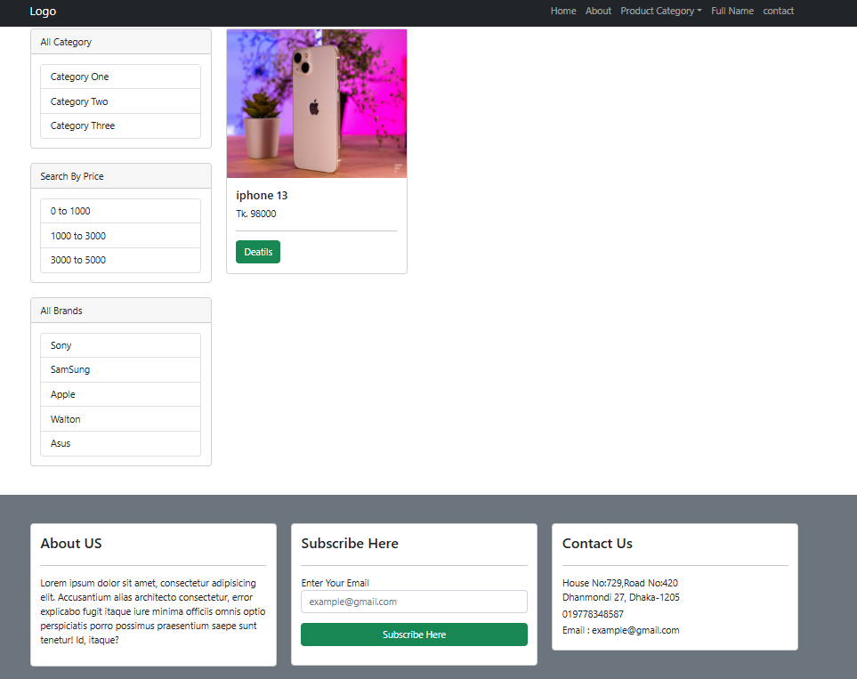

# 🛒 E-Commerce Website  

A simple **E-Commerce Website** built with **Raw PHP** (no frameworks).  
This project demonstrates a basic structure for managing products, categories, and static pages with reusable components.  

---

## 📂 Project Structure  

```

E-COMMERCE-WEBSITE/
│── app/
│   └── classes/
│       ├── Category.php
│       ├── Content.php
│       ├── FullName.php
│       ├── Home.php
│       ├── product.php
│       └── slider.php
│
│── assets/
│   ├── css/
│   ├── img/
│   └── js/
│
│── images/
│
│── pages/
│   ├── includes/
│   │   ├── footer.php
│   │   └── header.php
│   ├── about.php
│   ├── category.php
│   ├── contact.php
│   ├── deatils.php
│   ├── full_name.php
│   └── home.php
│
│── vendor/
│   └── composer/
│
│── autoload.php
│── action.php
│── composer.json
│── index.php
└── readme.md

````

---

## 🚀 Features  
- Dynamic Home Page with slider and products.  
- Category and product management.  
- Static pages: About, Contact, etc.  
- Modular structure with reusable header and footer.  
- Organized assets (CSS, JS, Images).  

---

## ⚙️ Requirements  
- PHP >= 7.4  
- MySQL Database  
- Composer (for autoloading)  
- Web Server (Apache/Nginx or Laragon/XAMPP)  

---

## ▶️ Installation & Setup  
1. Clone the repository  
   ```bash
   git clone https://github.com/your-username/ecommerce-website.git
   cd ecommerce-website
    ```

2. Run the project in a local server (XAMPP, Laragon, or built-in PHP server):

   ```bash
   php -S localhost:8000
   ```

3. Open in browser:

   ```
   http://localhost:8000
   ```

---

## 📌 Notes

* This project is built with **raw PHP** (no frameworks).
* Suitable for learning **basic e-commerce logic and raw PHP structure**.
* For production usage, additional features like authentication, security, and payment integration should be added.

## 📷 Screenshots

#### Home Page




#### About Page



#### Submission Page



#### Category Page


